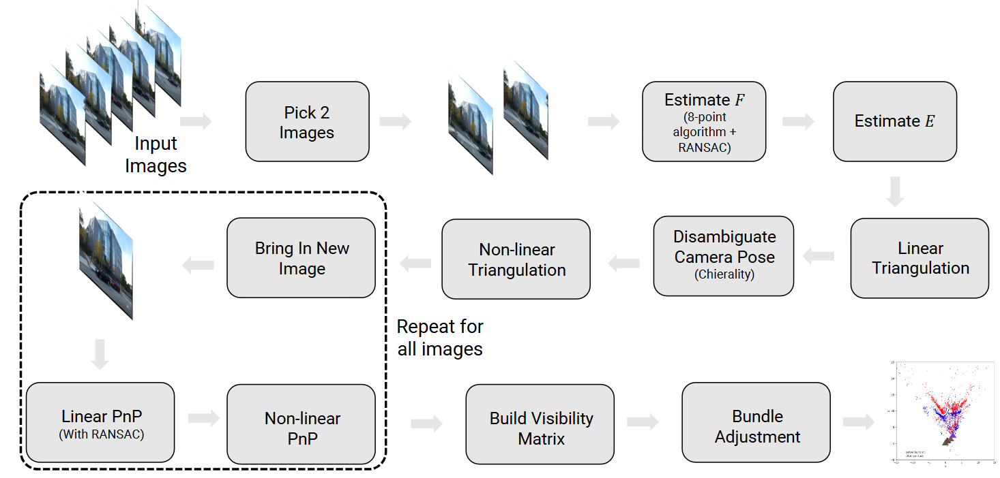

# 3D Scene Reconstruction from Monocular Images using SFM

## Overview

This project reconstructs a 3D scene and estimates camera poses using a given set of six monocular images and their feature point correspondences. The pipeline involves feature detection, camera pose estimation, and 3D point triangulation.

## Pipeline

1. **Feature Detection & Correspondences**: Extract keypoints and match features across images.
2. **Fundamental & Essential Matrix Estimation**: Compute the fundamental matrix to remove outliers and the essential matrix to estimate relative camera poses.
3. **Camera Pose Recovery**: Solve for possible camera poses and determine the correct one.
4. **Linear Triangulation**: Estimate 3D points from matched feature correspondences.
5. **Non-Linear Triangulation**: Refine 3D points using optimization techniques.
6. **Pose Estimation (PnP & RANSAC)**: Use Perspective-n-Point (PnP) with RANSAC to estimate camera poses.
7. **Bundle Adjustment**: Optimize camera parameters and 3D points for better accuracy.

## Output

- **Sparse 3D Point Cloud**: A set of reconstructed 3D points representing the scene.
- **Camera Poses**: Estimated positions and orientations of the cameras.

